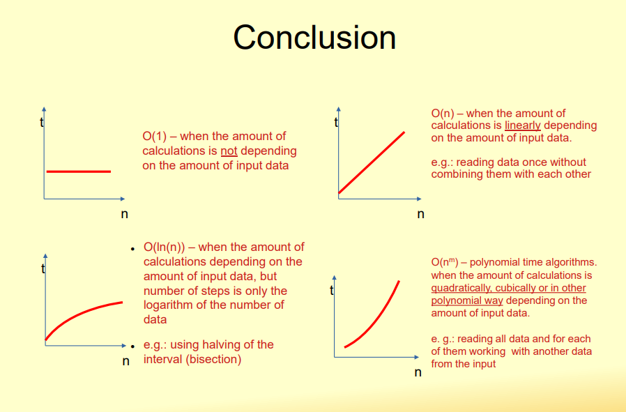

### week#1
An **algorithm** is an exact description of a finite sequence of steps for solving a given problem.

## Main properties of an algorithm
### 1.FINITENESS
Any algoritm must be *finite*, i.e. be executable in finite number of steps. Also it must work with finite amount of memory.
### 2.GENERALITY
Algorithm should be *general*, i.e. executable for any input data within given type and range.
### 3. DEFINITENESS
Every step in the algorithm must be clear and have no place for different interpretations, *no ambiguity*. Each step must be clear and unambiguous.
### 4. efectiveness
Alrgorithm should give correct result (output) in acceptable time. Handle all allowed inout data. 
### 5. enfficiency 
Use of  optimal resources ( time and memory). in most cases the time is decisive question. Efficiency means maximally possible decreasing of the *Computational complexity* of the algorithm.
---
**Computational complexity** of algorithms is the amount of time, storage, or other resources needed to execute them.
--- 
## Big O notation
O=Order of the function
Big O notation is used in CS to describe the performance or complexity of an algorithm. It is a function which describes the growth of the computation time due to the growth of the amount of input data. It is described as function of the amount of the input data N. 
## Common computational complexity examples:
- O(1)-The solution time is not depended on the lenght of the input data. if there are 10, 100, 1000 or 1000000 elements the algorithm takes always the same time. In this case we write O(1),, and call it constant time.
- O(n)-When time depends on the number of data: for array with 1000 elements we need 10 times more time than for the array with 100 elements (due to the lenght of the loop). then we write O(n) and call it " Linar time" what means "complexity grows linearly with the amount of the input data".
- O(n^2)-If its running time grows protportionally to the square of the input size n. Typically occurs when we have two nested loops, where each loop runs n times. We call it Quadratic time.
- O(logn)- if its running time frows logarithmically with the input size n. This usually happens when the problem size is reduced by a constant factor ( e.g., halved) at each step.
